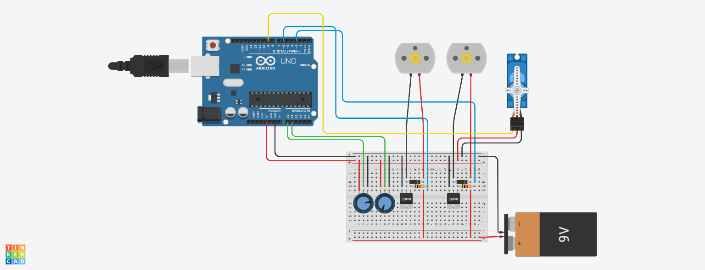

# Autonomous Mobile Robot (TinkerCad, C)

Academic FAB-LAB mobile-robot project developed with Arduino C and simulated in Tinkercad.

## Implementation

- Reads a first potentiometer on analog input A0.
- Maps A0 to a `0..35` PWM value and sends the same value to two DC-motor outputs on pins 3 and 6.
- Reads a second potentiometer on A1.
- Maps A1 to `0..180` degrees and commands a servo on pin 9.
- Prints both mapped values over serial at 9600 baud.

The Arduino program reads two potentiometers: one controls the speed of two DC motors through PWM, while the second controls a servo angle. The program also outputs the mapped control values through the serial interface. The project presentation documents the circuit and three-wheel mobile-robot concept.

## Repository contents

- `src/mobile_robot.ino` — Arduino code used in the project.
- `images/tinkercad-circuit.png` — Tinkercad circuit screenshot.
- [French project presentation (PPTX)](presentations/mobile-robot-presentation-fr.pptx).

## Requirements and use

Open `src/mobile_robot.ino` in the Arduino IDE, use the circuit shown in the project screenshot, and run the project with Arduino's standard `Servo` library.

## Project demonstration

The repository includes the Arduino source code, the original Tinkercad circuit screenshot and the French project presentation. Together they document the electronic connections, motor/servo control and the simulated mobile-robot prototype.

## Authors

- Adam El Akkaoui
- Mountassir Ikradine
